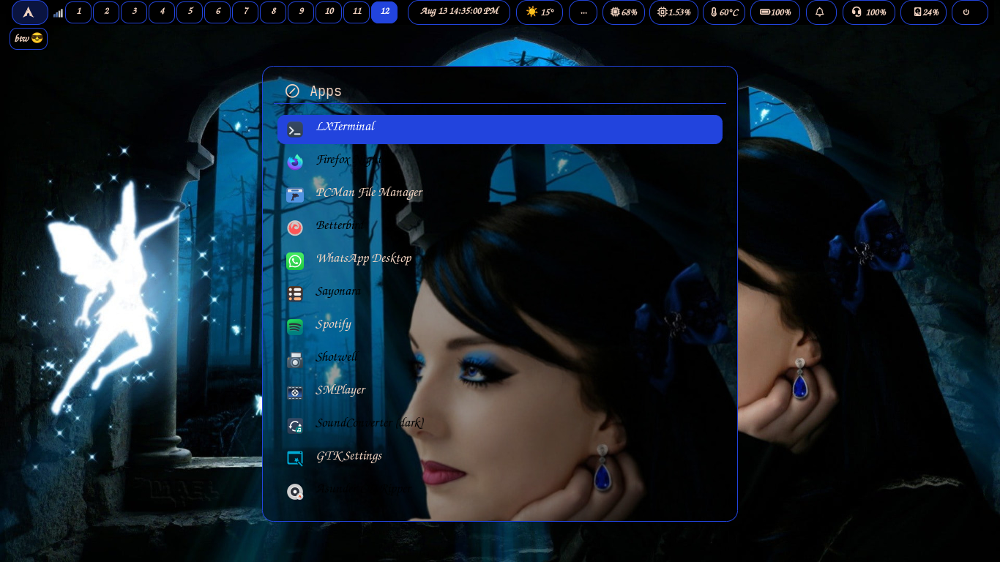
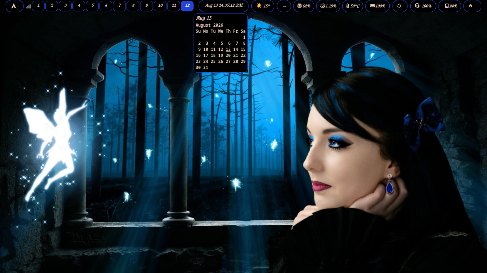
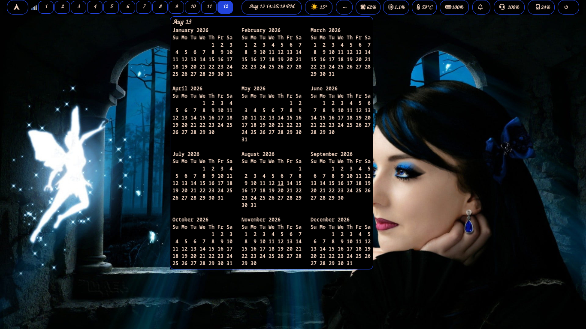
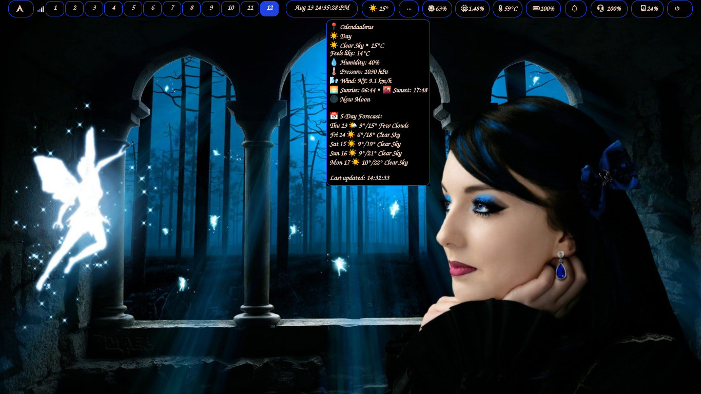
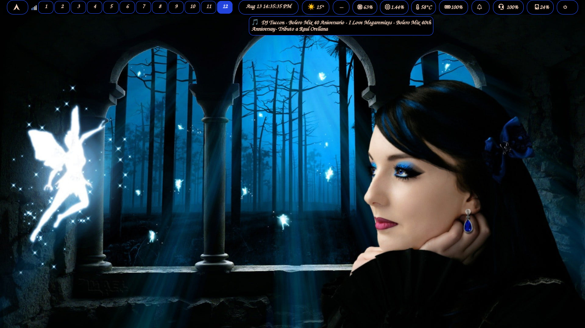
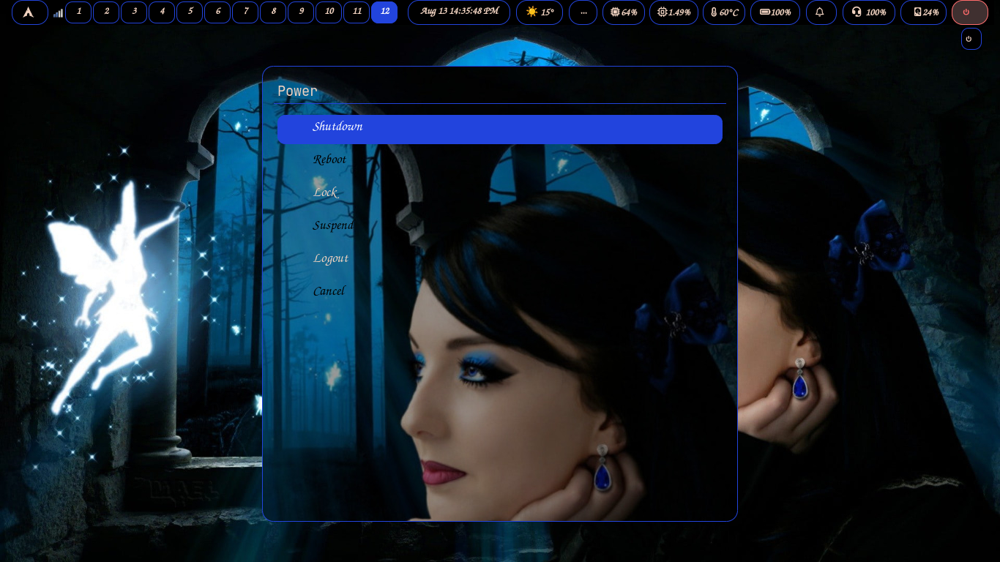

# Fenriz Dotfiles

  

Tiling Wayland Compositor (wlroots) with a 12-workspace Darkbeauty theme on Arch Linux. Features custom patched ext-workspace-v1 support for fully clickable Waybar pills.

---

## 📖 Documentation & Installation

For full installation instructions, keybinds, waybar configuration, and theming details, please visit the **[Official Documentation Website](https://wgparch.github.io/fenriz/)**.

## 📸 Screenshots

Full gallery: **[wgparch.github.io/fenriz/gallery](https://wgparch.github.io/fenriz/gallery/)**

